# Walid Hamyani

---

## 👋 About Me

Front-end Developer with a focus on **performance**, **scalability**, and **visual consistency**.  
I combine development skills with design thinking and digital marketing to create web products that work and look great.

Currently building with modern technologies and always learning what's necessary to ship what matters.

---

## 🛠️ Tech Stack

**Languages & Frameworks**

  

**Database & ORM**

  

**Tools & Platforms**

  

---

## 📊 GitHub Analytics

  

---

## 🤝 Let's Connect

I'm open to freelance projects, open source collaborations, and interesting opportunities.  
Feel free to reach out via [LinkedIn](https://linkedin.com/in/walid-hamyani-shin102) or [email](mailto:hamyaniw@gmail.com).

  
  
  

